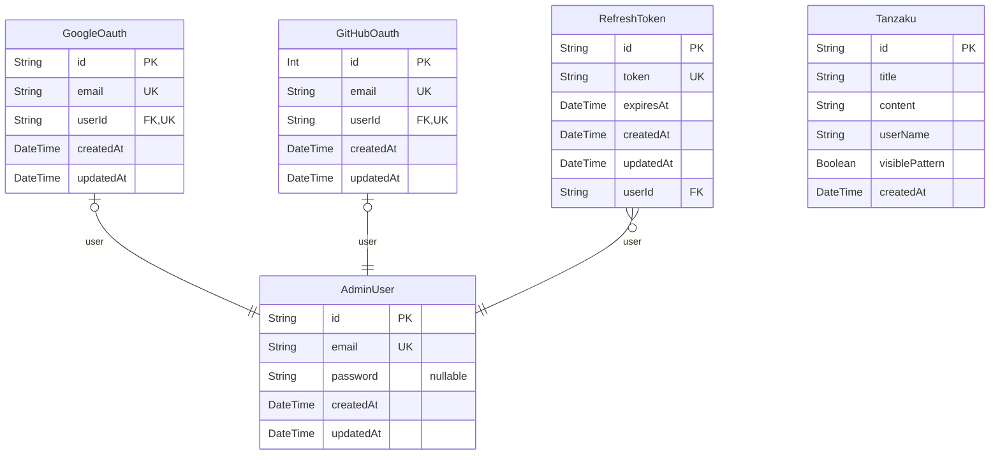

# DB Schema
> Generated by [`prisma-markdown`](https://github.com/samchon/prisma-markdown)

- [default](#default)

## default

### `AdminUser`

**Properties**
  - `id`: 
  - `email`: 
  - `password`: 
  - `createdAt`: 
  - `updatedAt`: 

### `GoogleOauth`

**Properties**
  - `id`: 
  - `email`: 
  - `userId`: 
  - `createdAt`: 
  - `updatedAt`: 

### `GitHubOauth`

**Properties**
  - `id`: 
  - `email`: 
  - `userId`: 
  - `createdAt`: 
  - `updatedAt`: 

### `RefreshToken`

**Properties**
  - `id`: 
  - `token`: 
  - `expiresAt`: 
  - `createdAt`: 
  - `updatedAt`: 
  - `userId`: 

### `Tanzaku`

**Properties**
  - `id`: 
  - `title`: 
  - `content`: 
  - `userName`: 
  - `visiblePattern`: 
  - `createdAt`: 