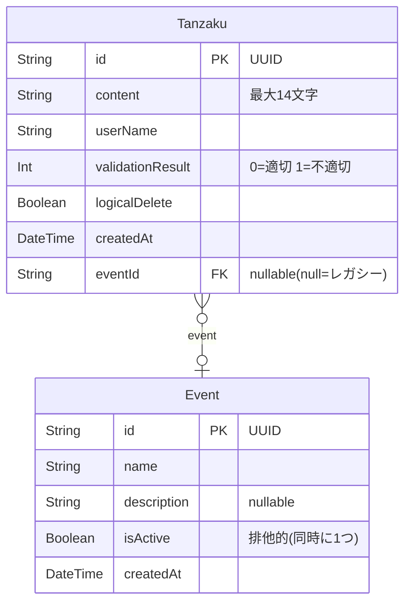

# DB Schema

スキーマの正は `migrations/*.sql`(Drizzle 定義: `src/db/schema.ts`)。

```mermaid
erDiagram
"Event" {
  String id PK "UUID"
  String name
  String description "nullable"
  Boolean isActive "排他的(同時に1つ)"
  DateTime createdAt
}
"Tanzaku" {
  String id PK "UUID"
  String content "最大14文字"
  String userName
  Int validationResult "0=適切 1=不適切"
  Boolean logicalDelete
  DateTime createdAt
  String eventId FK "nullable(null=レガシー)"
}
"Tanzaku" }o--o| "Event" : event
```

## 備考

- DATETIME 列の実体は TEXT。`YYYY-MM-DD HH:MM:SS`(UTC)と ISO 8601 が混在しうる。
  読み取りは `parseDbDate()` 両対応、書き込みは ISO 8601(Z)に統一(`src/lib/dates.ts`)
- `GET /tanzaku/client` のウォール表示ローテーションは書き込みゼロのステートレス計算
  (`src/lib/rotation.ts` + `TanzakuService.getClientTanzaku`)。
  かつて存在した `Tanzaku.visiblePattern`(消費型ローテーション用フラグ)は
  migrations/0007 で削除済み
- `Tanzaku.eventId` が null の行はイベント制導入前のレガシーデータ。
  アクティブイベントが無いときの表示対象になる
- 認証系テーブル(AdminUser / GoogleOauth / GitHubOauth / RefreshToken)は
  未使用だったため migrations/0006 で削除済み
