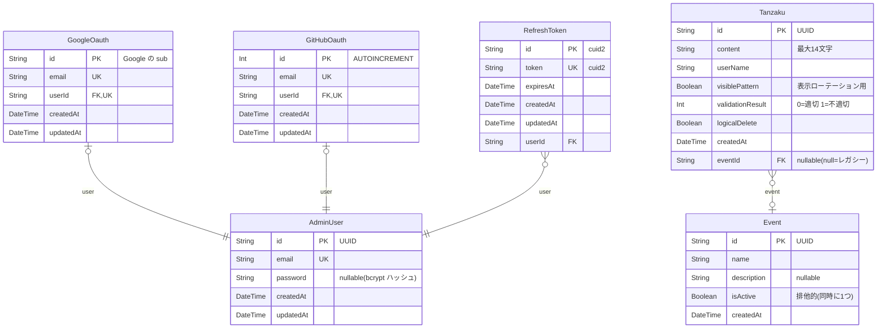

# DB Schema

スキーマの正は `migrations/*.sql`(Drizzle 定義: `src/db/schema.ts`)。

```mermaid
erDiagram
"AdminUser" {
  String id PK "UUID"
  String email UK
  String password "nullable(bcrypt ハッシュ)"
  DateTime createdAt
  DateTime updatedAt
}
"GoogleOauth" {
  String id PK "Google の sub"
  String email UK
  String userId FK,UK
  DateTime createdAt
  DateTime updatedAt
}
"GitHubOauth" {
  Int id PK "AUTOINCREMENT"
  String email UK
  String userId FK,UK
  DateTime createdAt
  DateTime updatedAt
}
"RefreshToken" {
  String id PK "cuid2"
  String token UK "cuid2"
  DateTime expiresAt
  DateTime createdAt
  DateTime updatedAt
  String userId FK
}
"Event" {
  String id PK "UUID"
  String name
  String description "nullable"
  Boolean isActive "排他的(同時に1つ)"
  DateTime createdAt
}
"Tanzaku" {
  String id PK "UUID"
  String content "最大14文字"
  String userName
  Boolean visiblePattern "表示ローテーション用"
  Int validationResult "0=適切 1=不適切"
  Boolean logicalDelete
  DateTime createdAt
  String eventId FK "nullable(null=レガシー)"
}
"GoogleOauth" |o--|| "AdminUser" : user
"GitHubOauth" |o--|| "AdminUser" : user
"RefreshToken" }o--|| "AdminUser" : user
"Tanzaku" }o--o| "Event" : event
```

## 備考

- DATETIME 列の実体は TEXT。`YYYY-MM-DD HH:MM:SS`(UTC)と ISO 8601 が混在しうる。
  読み取りは `parseDbDate()` 両対応、書き込みは ISO 8601(Z)に統一(`src/lib/dates.ts`)
- `Tanzaku.visiblePattern`: ウォール表示のローテーションに使用。
  `GET /tanzaku/client` が返した行は false になり、表示可能な行が尽きるとリセットされる
- `Tanzaku.eventId` が null の行はイベント制導入前のレガシーデータ。
  アクティブイベントが無いときの表示対象になる
- `GitHubOauth` はスキーマのみ存在(API 未実装)
