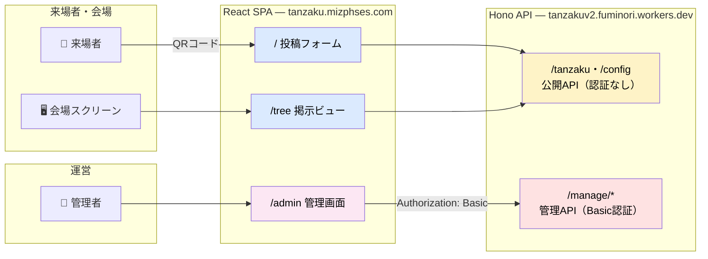
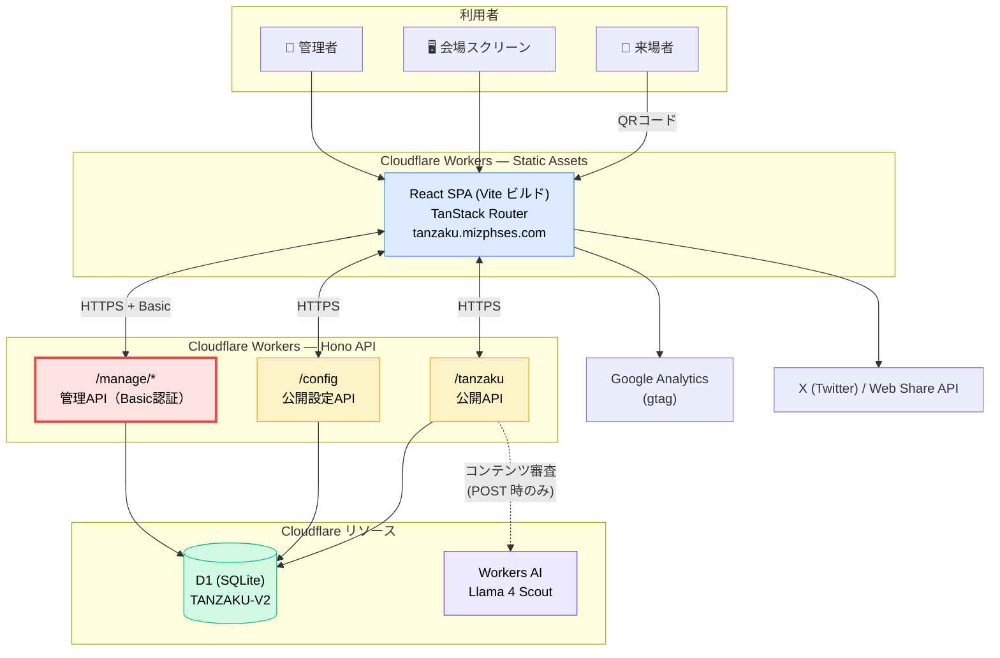
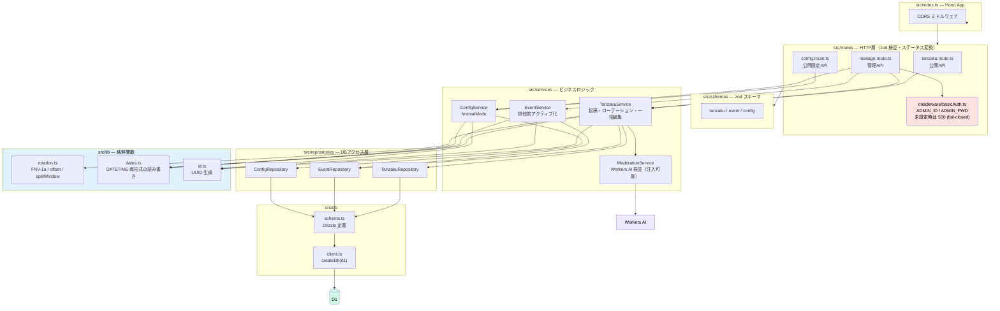
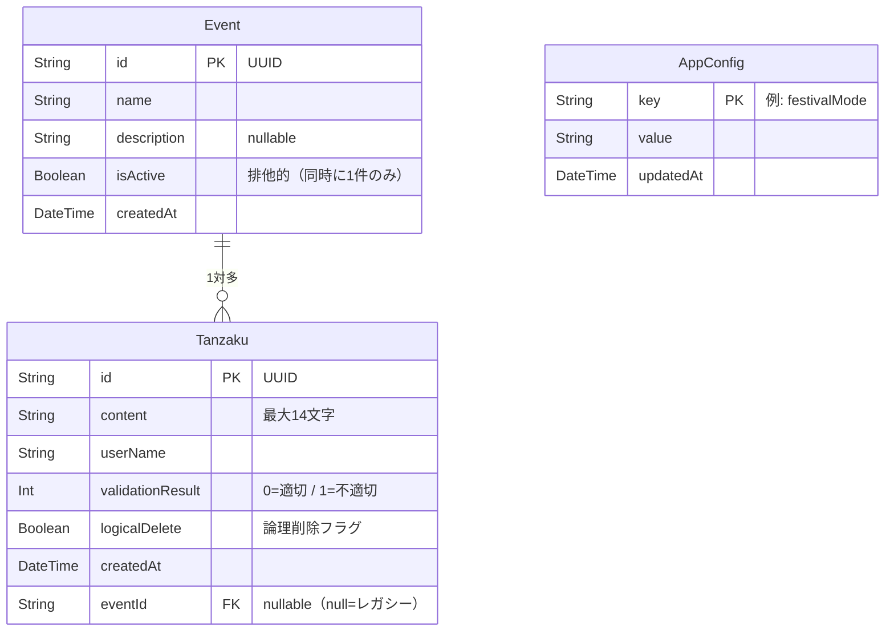
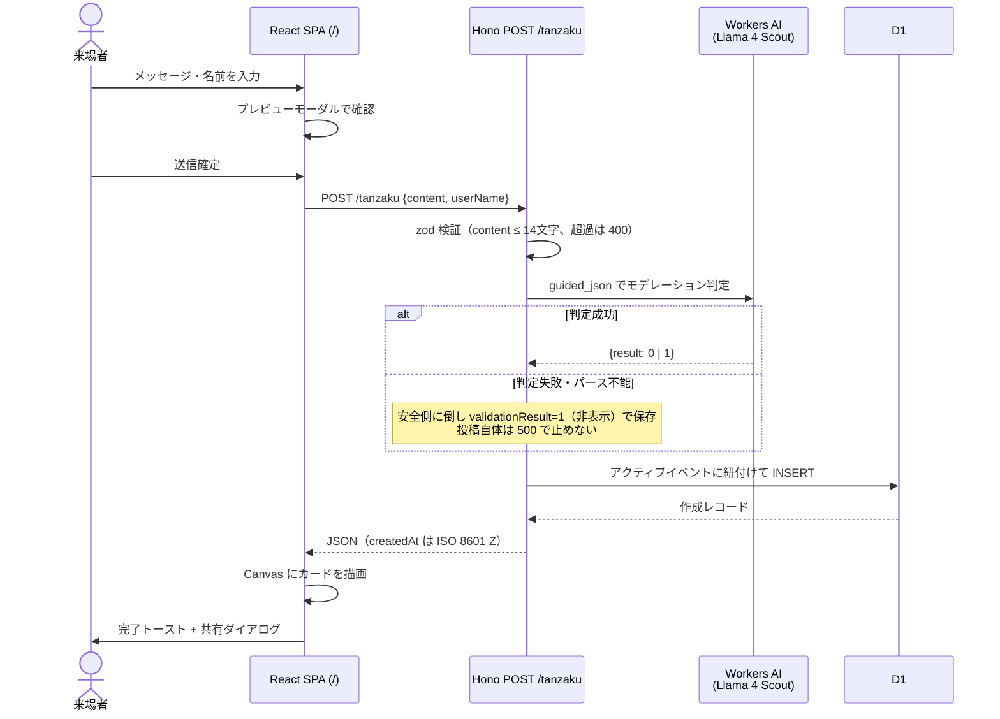
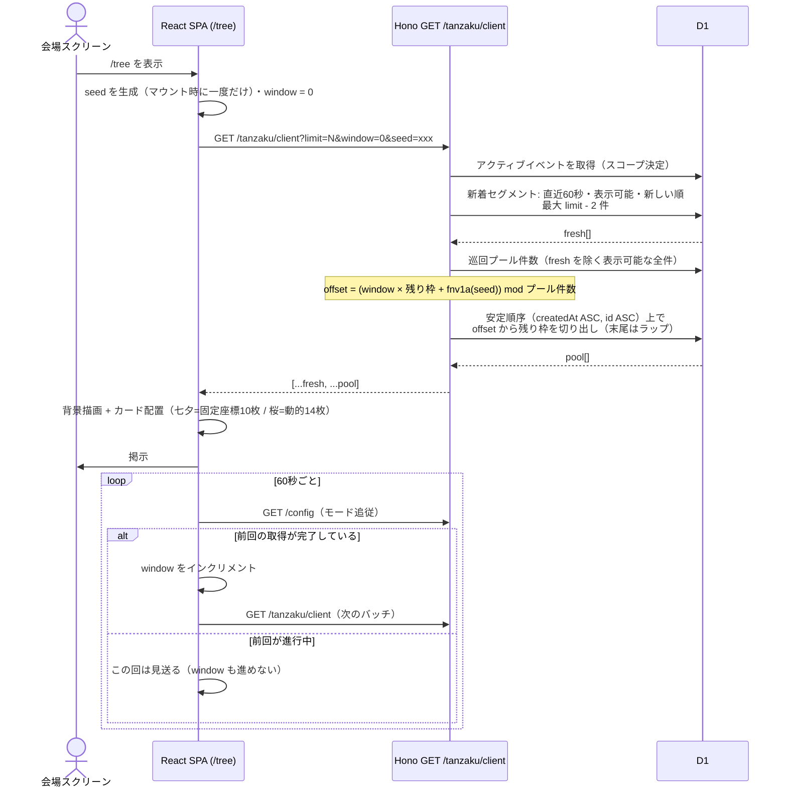
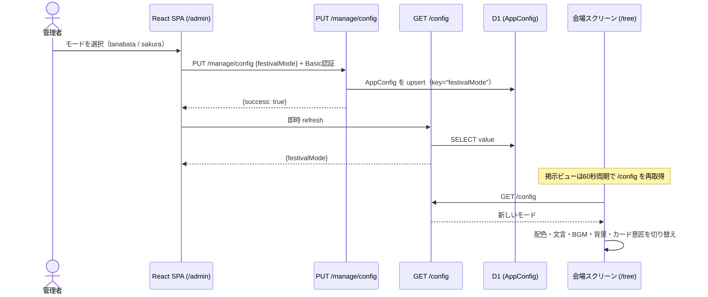
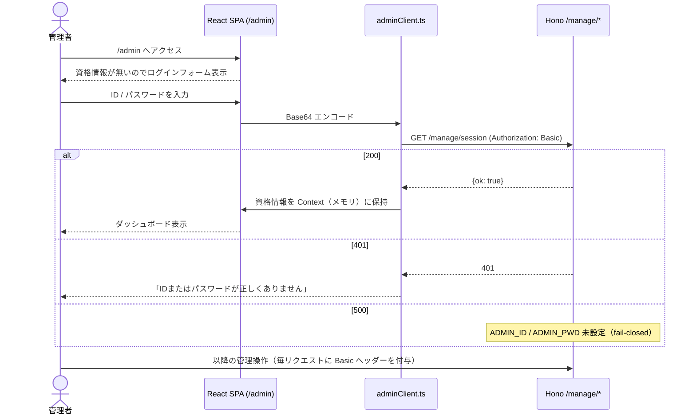
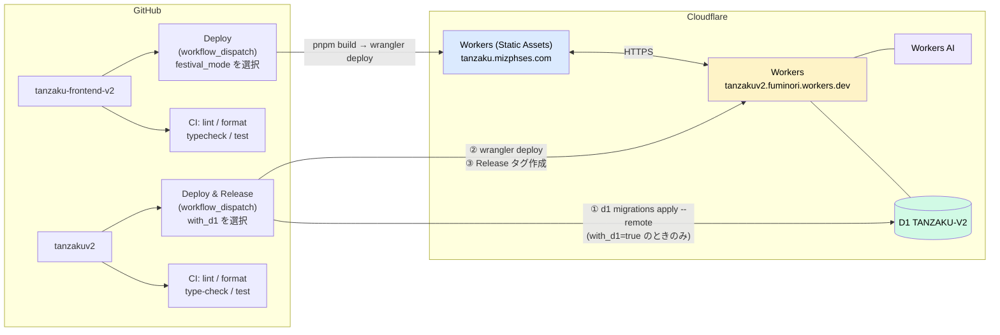

# iTL七夕祭 / iTL桜まつり 短冊システム — システム説明書

> 対象リポジトリ: [`tanzakuv2`](https://github.com/itl-marubu/tanzakuv2)（バックエンド・本リポジトリ）/ [`tanzaku-frontend-v2`](https://github.com/itl-marubu/tanzaku-frontend-v2)（フロントエンド）
>
> フロントエンド内部の詳細（描画・レイアウト計算・コンポーネント構成）は、フロントエンド側の `README.md` / `architecture.md` を正本とします。本書は**システム全体の俯瞰**とバックエンドの仕様をまとめたものです。

---

## 1. システム概要

学園祭イベントの来場者が、スマートフォンやPCから「短冊」（七夕モード）／「抱負」（桜モード）を投稿し、会場スクリーンにリアルタイム掲示するWebアプリケーション。

| 項目 | 内容 |
|------|------|
| サービス名 | iTL七夕祭 / iTL桜まつり 短冊アプリ |
| フロントエンドURL | `https://tanzaku.mizphses.com` |
| バックエンドURL | `https://tanzakuv2.fuminori.workers.dev` |
| 対象ユーザー | イベント来場者・会場運営／管理者 |
| 主な利用シーン | QRコードから来場者が投稿 / 会場スクリーンに `/tree` を掲示 / 運営が `/admin` からモデレーション |

### フェスティバルモード

1つのコードベースで2つのイベントモードを持ち、**DBの設定値（`AppConfig.festivalMode`）で実行時に切り替え**られます。管理画面から変更すると、掲示ビューは60秒以内にリロードなしで追従します。

| モード | イベント名 | 投稿物 | 掲示枚数 | カード意匠 |
|--------|-----------|--------|---------|-----------|
| `tanabata` | iTL七夕祭 | 短冊 | 10枚（固定座標） | 縦型 300×500・縦書き・笹背景 |
| `sakura` | iTL桜まつり | 抱負 | 14枚（動的配置） | 横型 375×225・横書き・桜背景＋花びら |

---

## 2. アクセス経路

来場者・会場スクリーン・管理者はすべてフロントエンドのSPAを入口とし、管理APIのみBasic認証で保護されています。



| 層 | 経路 | 認証方式 |
|---|---|---|
| 来場者 / 会場スクリーン | `tanzaku.mizphses.com` → 公開API | なし |
| 管理者 | `tanzaku.mizphses.com/admin` → `/manage/*` | Basic認証（`ADMIN_ID` / `ADMIN_PWD`） |

> **注意**: 管理画面UIは**フロントエンドの `/admin`** にあります。かつてバックエンドがインラインHTMLで返していた `/manage` の画面は廃止済みで、`GET /manage` はブックマーク互換のため `FRONTEND_BASEURL/admin` へ302リダイレクトするだけです（このリダイレクトのみ認証不要）。

---

## 3. 主な機能

### 来場者向け

| 機能 | 詳細 |
|------|------|
| 投稿 | メッセージ（最大14文字）と名前（最大8文字・フロント側の制約）を入力して送信 |
| プレビュー | 送信前にモーダルで実際のカード描画を確認 |
| SNS共有 | 投稿後、Canvas描画したカード画像をWeb Share API または X の intent URL で共有 |
| 掲示ビュー | `/tree` で背景（笹／桜）の上にカードを配置し、60秒ごとに入れ替え |

### 会場スクリーン向け（`/tree`）

- 60秒ごとに `GET /tanzaku/client` をポーリングし、表示中のカードを入れ替え
- 同じ周期で `GET /config` も再取得し、フェスティバルモードの切り替えに追従
- 無人稼働のため3重のガード（リクエストIDガード・単発化ゲート・30秒タイムアウト）で更新停止を防止
- 投稿用QRコードとイベント案内を常時表示

### 管理者向け（`/admin`）

| 機能 | 対応API |
|------|---------|
| ログイン（資格情報の疎通確認） | `GET /manage/session` |
| 短冊一覧・検索・フィルタ・ソート・統計 | `GET /manage/tanzakus` |
| 一括編集 / 論理削除 / 物理削除 | `POST /manage/tanzakus` |
| 新規作成（AI審査スキップ） | `POST /manage/tanzakus/create` |
| イベント作成・アクティブ化・全無効化 | `GET|POST /manage/events` ほか |
| フェスティバルモード切替 | `PUT /manage/config` |
| CSV出力 | （クライアント側で生成） |

資格情報は `localStorage` / `sessionStorage` に保存せず React Context（メモリ）にのみ保持します。XSS時の露出範囲を抑えるための選択で、リロード時に再ログインが必要になるトレードオフを受け入れています。

---

## 4. システム全体構成図



**認証スタックは全廃済み**です。かつて存在した `/auth`（Google OAuth・JWT・リフレッシュトークン）と関連テーブルは、未使用のため撤去されました（バックエンド: `migrations/0006` + PR #14 / フロントエンド: Googleログイン導線の削除）。現在システムに残る認証は管理APIのBasic認証のみです。

---

## 5. バックエンド構成（レイヤード）

`route → service → repository → Drizzle → D1` の一方向依存です。



### ディレクトリ構成

```
src/
├── index.ts                  # アプリ組み立て（CORS・ルート登録のみ）
├── db/
│   ├── schema.ts             # Drizzle スキーマ（migrations/*.sql の写像。DDL は生成しない）
│   └── client.ts             # createDb(d1)
├── middleware/basicAuth.ts   # 管理API用 Basic 認証（fail-closed）
├── routes/                   # HTTP層
├── schemas/                  # zod スキーマ
├── services/                 # ビジネスロジック
├── repositories/             # DBアクセス層
└── lib/                      # ローテーション計算 / 日時変換 / ID生成
```

> マイグレーションの正本は `migrations/*.sql` です。`src/db/schema.ts` はその写像であり、ここからDDLは生成しません。

---

## 6. データモデル（ERD）



### 取り決め

- **DATETIME 列の実体は TEXT**。既存データは `YYYY-MM-DD HH:MM:SS`（UTC・SQLiteの `CURRENT_TIMESTAMP` 由来）と ISO 8601（旧Prisma書き込み由来）が混在します。読み取りは `parseDbDate()` で両対応、書き込みは ISO 8601（Z）に統一（`src/lib/dates.ts`）
- **BOOLEAN 列の実体は INTEGER 0/1**（Drizzle の `integer({ mode: "boolean" })`）
- `Tanzaku.eventId` が `null` の行はイベント制導入前のレガシーデータ。アクティブイベントが無いときの表示対象になります
- 削除済みテーブル: 認証系4テーブル（`AdminUser` / `GoogleOauth` / `GitHubOauth` / `RefreshToken`）は `migrations/0006` で削除
- 削除済み列: `Tanzaku.visiblePattern`（消費型ローテーション用フラグ）は、ステートレス再設計に伴い `migrations/0007` で削除

### マイグレーション履歴

| # | 内容 |
|---|------|
| 0001 | 初期スキーマ（Prisma由来。認証系テーブル含む） |
| 0002 | `Tanzaku.title` を削除 |
| 0003 | `validationResult` を追加 |
| 0004 | `Event` テーブル追加・`Tanzaku.eventId` 追加 |
| 0005 | `AppConfig` テーブル追加（ランタイム設定のKVストア） |
| 0006 | 未使用の認証系テーブルを削除 |
| 0007 | `Tanzaku.visiblePattern` を削除 |

---

## 7. 主要データフロー

### 7.1 投稿フロー



モデレーションの詳細（`src/services/moderation.service.ts`）:

- モデルは `@cf/meta/llama-4-scout-17b-16e-instruct`。旧 `llama-3.3-70b` は重く応答を支配していたため差し替え
- チャット（`messages`）形式 + `guided_json` で構造化出力を強制。few-shot例文の「続き」を生成してしまう `prompt` 形式は不採用
- 応答から `0`/`1` を頑健に抽出。文中に複数の `result` が現れた場合、値が一意のときだけ採用し、`0`/`1` が混在すれば判別不能として安全側（非表示）に倒す

### 7.2 掲示ビューのローテーション（ステートレス）

`GET /tanzaku/client` は**DBへの書き込みを一切行わない**計算です。巡回セグメントは `window`/`seed` だけで位置が決まるため、同じ `limit`/`window`/`seed` の呼び出しは（データが変わらない限り）同じ窓を読みます。

ただし**時間に依存しない冪等ではありません**。新着セグメントの判定はサーバー現在時刻から60秒窓を毎回計算し直すため、DBが変わらなくても時間経過だけで、新着だった行が新着枠から外れて巡回セグメントの母集団へ移り、レスポンスが変わります。決定的なのは「同一時刻（同一の60秒窓）で見たとき」です。



**設計上の契約**

| セグメント | 内容 |
|---|---|
| 新着 | 直近60秒（`FRESH_WINDOW_MS`）以内の表示可能な投稿を新しい順に最大 `limit - 2`（`FRESH_RESERVED_SLOTS`）件。`window`/`seed` に非依存なので、リロードを繰り返しても同じ新着が先頭に出る |
| 巡回 | 残り枠を、新着以外の安定順序リスト上の窓で充填。`offset = (window × 残り枠数 + fnv1a(seed)) mod プール件数`、末尾に達したら先頭へラップ（最大2クエリに分割） |

- 保証は「投稿直後は必ず出る」ではなく「**直近 `limit - 2` 件に入っていれば出る**」です。60秒以内の投稿がこの枠を超えた場合、溢れた分（古い方）は巡回セグメントの母集団へ回ります
- `window`/`seed` を省略するとサーバー壁時計から `window` を導出します（カーソル非対応クライアント向けの既定挙動）
- `limit` はサーバー側で 1〜30 にクランプされます
- カーソルをクライアントが持つ設計にしているのは、**リロードを「次のバッチへ進める」操作として機能させる**ためです。GETに副作用が無いので、動作確認で `curl` を叩いても会場の表示順は進みません

### 7.3 フェスティバルモードの切り替え



- ビルド時の `VITE_FESTIVAL_MODE` は**起動時の初期値**にすぎず、実際のモードは `GET /config` の値が上書きします
- 未設定時のデフォルトは `tanabata`（`ConfigService`）
- 不正値はフロント側で `console.error` を出して現在値を維持します

### 7.4 管理者ログインフロー



CORSの都合上 `credentials: "omit"` とし、`Authorization: Basic` ヘッダーを毎リクエスト手動で付与します。

---

## 8. APIエンドポイント一覧

仕様の正本は `docs/openapi.yml`（OpenAPI 3.0 / version 2.0.0）です。フロントエンドの型生成もこのファイルから行います。

### 公開API（認証不要）

| メソッド | パス | 説明 |
|----------|------|------|
| GET | `/tanzaku` | 全短冊取得（イベント情報を含む・`createdAt DESC`） |
| POST | `/tanzaku` | 短冊作成（AI審査付き。`content` は14文字超で400） |
| GET | `/tanzaku/check/:id` | ID指定で1件取得（無ければ404） |
| GET | `/tanzaku/client` | 掲示用取得（ステートレス・`?limit=N&window=N&seed=S`） |
| GET | `/config` | フェスティバルモード取得 |
| GET | `/manage` | `FRONTEND_BASEURL/admin` へ302リダイレクト（互換用・認証不要） |

`/tanzaku/client` のクエリは不正値でも400にせず安全なフォールバックへ倒します（`limit` は 10 → 1〜30にクランプ、`window`/`seed` は未指定扱い）。

### 管理API（Basic認証必須）

| メソッド | パス | 説明 |
|----------|------|------|
| GET | `/manage/session` | 資格情報の疎通確認（`{ok: true}`） |
| GET | `/manage/tanzakus` | 全短冊取得 |
| POST | `/manage/tanzakus` | 一括編集（`update` / `delete`=論理削除 / `hardDelete`=物理削除） |
| POST | `/manage/tanzakus/create` | 短冊作成（AI審査スキップ・`validationResult`/`eventId` 指定可） |
| GET | `/manage/events` | イベント一覧（短冊件数 `_count.tanzakus` 付き） |
| POST | `/manage/events` | イベント作成 |
| POST | `/manage/events/:id/activate` | イベントを排他的にアクティブ化（D1 batch でアトミック） |
| POST | `/manage/events/deactivate-all` | 全イベントを無効化 |
| PUT | `/manage/config` | フェスティバルモードの更新 |

---

## 9. 技術スタック

### フロントエンド（tanzaku-frontend-v2）

| 分類 | 採用技術 |
|------|---------|
| ビルド | Vite 8 |
| UI | React 19 |
| ルーティング | TanStack Router 1.x（ファイルベース・自動コード分割） |
| スタイリング | Tailwind CSS 4（`@tailwindcss/vite`） |
| 状態管理 | React Context（FestivalMode / AdminAuth）+ ローカルstate |
| API通信 | openapi-fetch 0.14（公開API）/ fetch ラッパー（管理API） |
| 型生成 | openapi-typescript 7 |
| 描画 | Canvas 2D API |
| QRコード | qrcode 1.5 |
| テスト | Vitest 4（`environment: node` で純粋関数を検証） |
| Lint / Format | Biome 1.9 |
| 分析 | Google Analytics（gtag・SPA遷移時に手動 `page_view`） |
| ホスティング | Cloudflare Workers Static Assets（`not_found_handling: single-page-application`） |

### バックエンド（tanzakuv2）

| 分類 | 採用技術 |
|------|---------|
| ランタイム | Cloudflare Workers |
| フレームワーク | Hono 4 |
| ORM | Drizzle ORM（`drizzle-orm/d1`） |
| バリデーション | Zod 4 + `@hono/zod-validator` |
| データベース | Cloudflare D1（SQLite） |
| AI審査 | Workers AI（`@cf/meta/llama-4-scout-17b-16e-instruct`） |
| 管理API認証 | Basic認証（Hono `basicAuth` / fail-closed） |
| API仕様 | OpenAPI 3.0（`docs/openapi.yml` が正本） |
| テスト | Vitest 4 + `@cloudflare/vitest-pool-workers`（workerd 上で実行・D1 はテスト毎にクリア） |
| Lint / Format | Biome 1.9 |
| パッケージ管理 | pnpm 10 |

---

## 10. CI / デプロイ構成



### CI

両リポジトリとも `main` への push / PR で実行されます。

| ジョブ | 内容 |
|--------|------|
| lint | Biome lint |
| format | Biome format チェック |
| type-check | `tsc --noEmit` |
| test | Vitest |

バックエンドのCIは各ジョブで `pnpm gen`（`wrangler types`）を実行してから検証します。

### デプロイ

いずれも GitHub Actions の `workflow_dispatch`（手動実行）です。**wrangler の直叩きではなく Actions 経由で実行してください。**

| リポジトリ | ワークフロー | 入力 | 内容 |
|---|---|---|---|
| tanzakuv2 | `Deploy & Release` | `with_d1`（既定 true） | `d1 migrations apply --remote`（`with_d1` 有効時のみ）→ Secrets を注入して `wrangler deploy` → `vYYYY.MM.DD.HHmm` タグでRelease作成 |
| tanzaku-frontend-v2 | `Deploy` | `festival_mode`（`tanabata` / `sakura`） | 選択値を `VITE_FESTIVAL_MODE` に渡して `pnpm build` → `wrangler deploy` → Release作成 |

バックエンドの3ジョブ（`db-deploy` → `build` → `release`）は直列で、前段が失敗すると後続はスキップされます。したがって **Release タグが打たれていることは、マイグレーションとデプロイの両方が成功した証跡**になります（`with_d1=false` の場合はマイグレーションを実行しないだけで、デプロイとReleaseは通常どおり実行されます）。

> この直列化は「マイグレーション先行」を前提とします。列削除などの破壊的マイグレーションは、その列を参照しないコードを先のリリースで出してから、次のリリースで適用してください（`migrations/0007` の `visiblePattern` 削除で実際に踏んでいる手順）。

> フロントエンドの `festival_mode` はあくまで**ビルド時の初期値**です。運用中の切り替えは管理画面（`PUT /manage/config`）から行い、再デプロイは不要です。

---

## 11. 環境変数・Secrets

### フロントエンド（ビルド時に埋め込み）

`.env.development` / `.env.production` がリポジトリにコミットされています。

| 変数名 | 説明 |
|--------|------|
| `VITE_TANZ_BACKEND` | バックエンドAPIのベースURL |
| `VITE_GA_ID` | Google Analytics 測定ID（`index.html` の `%VITE_GA_ID%` に展開） |
| `VITE_FESTIVAL_MODE` | フェスティバルモードの初期値（`tanabata` / `sakura`） |
| `VITE_BASEURL` | 現在コード上では未参照（過去の共有URL生成で使用していた残り） |

### バックエンド

| 名前 | 種別 | 説明 |
|------|------|------|
| `DB` | Binding | Cloudflare D1（`TANZAKU-V2`） |
| `AI` | Binding | Workers AI |
| `FRONTEND_BASEURL` | Secret | フロントエンドのベースURL（`GET /manage` のリダイレクト先） |
| `ADMIN_ID` | Secret | 管理APIのBasic認証ユーザー名 |
| `ADMIN_PWD` | Secret | 管理APIのBasic認証パスワード |

Bindings は `wrangler.jsonc`、Secrets は GitHub Actions の Secrets から `wrangler-action` 経由で注入されます。ローカル開発では `.dev.vars`（`.dev.vars.example` をコピー）に設定します。

> `ADMIN_ID` / `ADMIN_PWD` が未設定の場合、既定の資格情報へフォールバックせず `/manage/*` が 500 を返します（fail-closed）。

---

## 12. ローカル開発

```sh
# バックエンド（tanzakuv2）
pnpm install
cp .dev.vars.example .dev.vars   # ADMIN_ID / ADMIN_PWD / FRONTEND_BASEURL を設定
pnpm migrate:dev                 # ローカル D1 にマイグレーション適用
pnpm dev                         # wrangler dev（http://localhost:8787）

pnpm test        # vitest（workerd 上で実行）
pnpm type-check
pnpm check       # biome lint + format
pnpm gen         # wrangler types（CloudflareBindings 再生成）
```

```sh
# フロントエンド（tanzaku-frontend-v2）
pnpm install
pnpm dev         # vite
pnpm gen:api     # openapi.yml から型生成
```

---

## 13. 関連ドキュメント

| ドキュメント | 内容 |
|---|---|
| `README.md` | バックエンドのアーキテクチャ・開発手順 |
| `docs/openapi.yml` | API仕様の正本（フロントエンドの型生成元） |
| `docs/ERD.md` | DBスキーマ |
| `docs/event-design.md` | イベント管理機能の当初設計案（実装済み・記述はPrisma時代のもの） |
| フロント `README.md` | フロントエンドの機能・環境変数・スクリプト |
| フロント `architecture.md` | フロントエンドの詳細構成図・描画／レイアウトの設計判断 |
